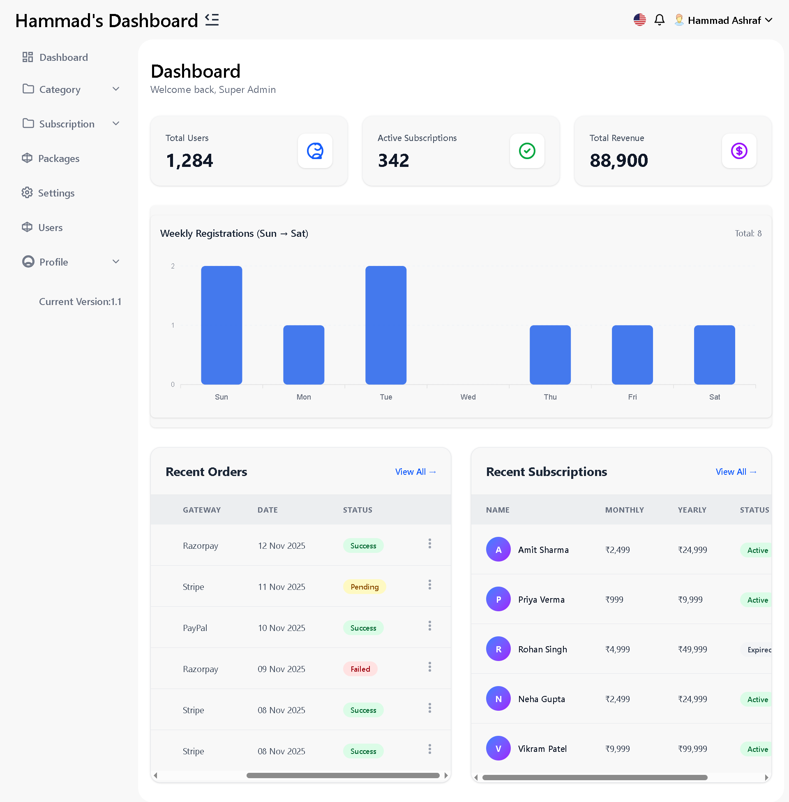
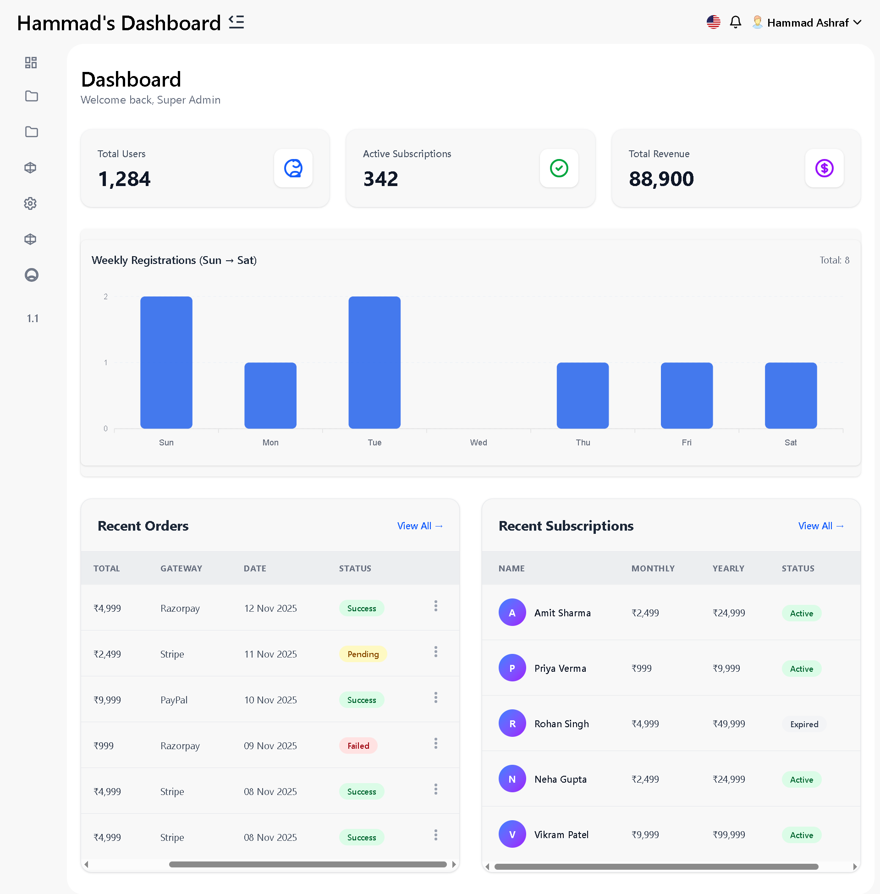

# 📊 Admin Dashboard – ReactJS + Tailwind CSS

A modern, responsive Admin Dashboard built using ReactJS, Tailwind CSS, ApexCharts, and reusable components.
This dashboard includes weekly registrations graphs, mobile-friendly sidebar, dynamic data tables, and fully responsive UI.

---

## 🚀 Features

- 📱 Responsive Layout with sidebar, header, and content alignment

- 📊 Weekly Registrations Bar Chart using ApexCharts

- 📦 Dashboard Stats Cards (dynamic from array/object)

- 🧾 Two Dynamic Tables Section

## Orders Table

## Subscriptions Table

- 📤 Horizontal Scrollable Table

- 🔧 Reusable Components Structure

- 🎨 Tailwind CSS Styling

- 🧩 Mobile Sidebar with Smooth Toggle

- ⚡ Fast, clean, modern UI

---

# 🛠️ Tech Stack

- Technology Purpose
- ReactJS Frontend Framework
- Vite / CRA Build Tool
- Tailwind CSS Styling
- ApexCharts Graphs & Charts
- React Icons / SVGs Icons
- Custom Components UI Architecture

---

## 📂 Folder Structure

-src/
├── components/
│ ├── dashboard/
│ │ ├── WeeklyChart.jsx
│ │ ├── StatsCards.jsx
│ │ ├── TwoTablesSection.jsx
│ │ └── Sidebar.jsx
│ ├── Header.jsx
│ ├── Layout.jsx
├── pages/
│ └── Dashboard.jsx
├── App.jsx
└── main.jsx

---

## 📸 Screenshots

- 

---

- 

---

## 🧩 Dashboard Home

- 📊 Weekly Registrations Graph

- 📦 Stats Cards Section

- 🧾 Orders Table Section

- 📑 Subscriptions Table Section

- 📱 Mobile Sidebar Open

## 📈 Weekly Registrations Graph (ApexCharts)

- The chart is fully responsive and auto-adjusts after sidebar toggle.
